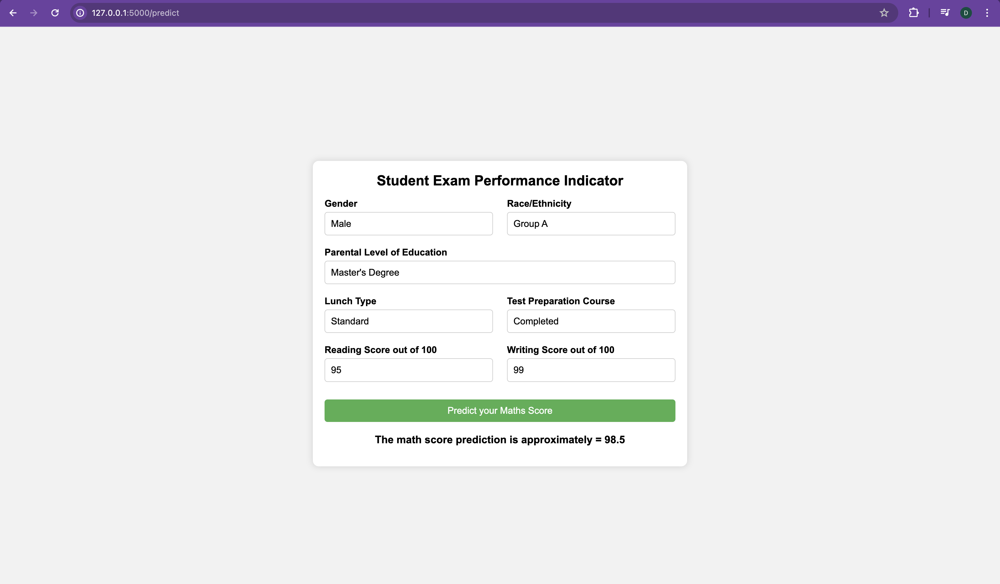

## Goal
The goal of this project is to understand the influence of gender, race/ethnicity, parental level of education, lunch and test preparation course on students performance.

> I have created a Flask app to test the application. However, app deployment is in progress.